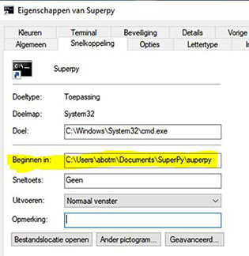

# Superpy
## Handleiding
Versie AB 26 mei 2023

*Deze handleiding is geschreven voor windows*

Superpy is een toepassing voor supermarkten om de inventaris van producten bij te kunnen houden en van deze gegevens verschillende rapporten te kunnen genereren.

In het programma kan worden bijgehouden:
- Voor hoeveel een product is gekocht en wat de vervaldatum is;
- Voor hoeveel elk product is verkocht of als het is verlopen, het feit dat het is verlopen
- Welke producten de supermarkt aanbiedt
- Hoeveel van elk type product de supermarkt heeft op dit moment of had op een ingegeven datum
- Wat de voorraad was op een bepaald moment of nu is
- Een opbrengstenrapport
- Een winstrapport

## Gebruik van het programma
Superpy is een CLI ( command-line-interface) programma dat opdrachten uitvoert door ingevoerde commanda's in plaats van aanwijzen en klikken met een muis. 
Om gebruik te kunnen maken van Superpy dienen de volgende software en python-libraries gedownload te worden voor zover die nog niet zijn geïnstalleerd:
> - [Python](https://www.python.org/downloads/) 
> - [Pandas](https://pandas.pydata.org/docs/getting_started/install.html)  (via commando: (python -m) pip install pandas )
> - [Numpy](https://numpy.org/install/)
(via commando: (python -m) pip install numpy)
> - [Matplotlib](https://matplotlib.org/stable/users/installing/index.html)  (via commando: (python -m) pip install -U matplotlib )
> - [Tabulate](https://pypi.org/project/tabulate/)  (via commando: (python -m) pip install tabulate)
> - [Parquet](https://pypi.org/project/parquet/)  (via commando: (python -m) pip install parquet)

Download de bestanden voor Superpy van Github (https://github.com/AnnetteBotman/Winc_module5_assingment-Superpy) en zet de folder Superpy in een (beveiligde) folder op het netwerk of PC. 

Vervolgens kan via de commandline prompt in windows de directory worden aangepast en commando's worden ingevoerd.

Kopieer het complete pad (tot in de folder "superpy" waar het bestand main.py in staat).

Het bereiken van de directory in de commandline prompt kan op 2 manieren:
- Ga in windows naar het vergrootglas (linksonder)
- Tik in CMD
- Druk op Opdrachtprompt
- Type achter de prompt cd <spatie> en vervolgens plakt u met Ctlr+v het pad hierachter

- Met Enter wordt de directory aangepast.

Een andere manier is om een snelkoppeling te maken naar deze directory in de commandline prompt.
- Klik op het bureaublad met de rechtermuisknop
- Kies Nieuw->snelkoppeling
- Geef als locatie het volgende op:
C:\Windows\System32\cmd.exe
- Geef snelkoppeling de naam Superpy
- Voltooien en klik vervolgens met rechtermuisknop op de snelkoppeling en ga naar Eigenschappen
- Zet hier bij *Beginnen in* het gehele gekopieerde pad

- OK
- Als u nu op de snelkoppeling klikt, ziet u de commandlinepromt en staat u direct in de juiste directory

## Invoeren van commando's

*Enkele opmerkingen vooraf*

Bij het starten van het programma wordt in de folder superpy een aantal directories aangemaakt waarin rapporten en grafieken automatisch worden opgeslagen.

Voor het invoeren van producten en het maken van rapporten kan een datum, of een periode (dmv invoer van 2 datums) worden gekozen. Deze worden automatisch gecontroleerd op het juiste format. Indien de invoer niet aan dit format voldoet, krijgt u een melding.

Ieder commando begint met het intypen van **python main.py** en vervolgens het commando, subcommando en eventueel invoergegevens. Hieronder volgt een overzicht van de commando's. 

Deze worden in de handleiding verder toegelicht met voorbeelden.

## Overzicht commando's en subcommando's

- **time** --check  --advance  --setback  --setdate  --reset
- **buy** vervolgens input gekochte producten
- **sell** vervolgens input verkocht producten
- **report** --inventory --revenue --profit
- bij ieder rapport --now --yesterday --date --date2

Voor help kan -h of --help worden ingetypt, dit geeft een korte hint voor de vereiste of te gebruiken commando's:

Voor help van subcommando's kan -h of --help in combinatie met het subcommando worden gebruikt. Zo kan bijvoorbeeld voor uitleg over **time** *python main.py time -h* worden ingetypt:

Met behulp van de pijltjestoetsen omhoog/omlaag kan door eerder gegeven commando's gebladerd worden voor hergebruik.

## Het aanpassen van de datum voor invoer van producten
Bij de start van het programma wordt een datumtekst aangemaakt. Deze wordt standaard gebruikt als koop- of verkoopdatum bij de invoer van producten.

**Belangrijk**: check altijd de datum voordat u producten gaat invoeren!

*python main.py time* is het hoofdcommando dat wordt gebruikt voor het aanroepen van datumfuncties

*python main.py time --check*  geeft de datum zoals deze op dat moment staat ingesteld
*python main.py time --advance* en een nummer(aantal dagen):  zet de datum **die op dat moment staat ingesteld** het aantal ingegeven dagen vooruit.

*python main.py time --setback* en een nummer(aantal dagen):  zet de datum **die op dat moment staat ingesteld** het aantal ingegeven dagen achteruit.

*python main.py time --setdate* en een datum in het format jaar-maand-dag (YYYY-MM-DD)
geeft de ingevoerde datum terug

*python main.py time --reset* zet de datum op huidige datum (vandaag)

## Het invoeren van gekochte producten

Check voor het invoeren van één of meerder producten altijd eerst de ingestelde datum met python main.py --check en pas deze zonodig aan. Dit is de datum die wordt gebruikt voor de inkoopdatum

*python main.py buy* is het hoofdcommando dat wordt gebruikt voor het invoeren van gekochte producten

Type vervolgens in genoemde volgorde de gegevens over het product in,
bij gebruik van de ingestelde datum:

**productnaam &nbsp;&nbsp;&nbsp;aantal &nbsp;&nbsp;&nbsp; inkoopprijs (per stuk) &nbsp;&nbsp;&nbsp;expirydate**

Is er bijvoorbeeld één product dat met een andere inkoopdatum ingevoerd moet worden, kan er een datum worden ingetypt en wordt de invoer:

**datum &nbsp;&nbsp;&nbsp;productnaam &nbsp;&nbsp;&nbsp;aantal &nbsp;&nbsp;&nbsp;inkoopprijs (per stuk) &nbsp;&nbsp;&nbsp;expirydate**

Deze datum geldt slechts éénmalig.

Probeert u een product in te voeren waarvan de expirydate vóór de inkoopdatum ligt, krijgt u een melding dat het product over datum is, deze wordt niet ingevoerd. Ingevoerde producten worden toegevoegd aan de het bestand "bought.scv" met een buyid. Op meerdere dagen kunnen dezelfde producten zijn gekocht met eenzelfde expirydate, deze krijgen allen een eigen buyid omdat de inkoopdatum immers verschilt.

Hieronder voorbeelden van invoer met vooraf ingesteld datum, een eenmalige datum en een over-datum-product.

## Het invoeren van verkochte producten
De invoer van verkochte producten werkt grotendeels hetzelfde; check dus ook eerst voor het invoeren van één of meerder producten altijd de ingestelde datum met python main.py --check en pas deze zonodig aan. Dit is de datum die wordt gebruikt voor de verkoopdatum

*python main.py sell* is het hoofdcommando dat wordt gebruikt voor het invoeren van verkochte producten

Type vervolgens in genoemde volgorde de gegevens over het product in,
bij gebruik van de ingestelde datum:

**productnaam &nbsp;&nbsp;&nbsp;aantal &nbsp;&nbsp;&nbsp; verkoopprijs (per stuk) &nbsp;&nbsp;&nbsp;expirydate**

Is er bijvoorbeeld één product dat met een andere verkoopdatum ingevoerd moet worden, kan er een datum worden ingetypt en wordt de invoer:

**datum &nbsp;&nbsp;&nbsp;productnaam &nbsp;&nbsp;&nbsp;aantal &nbsp;&nbsp;&nbsp;verkoopprijs (per stuk) &nbsp;&nbsp;&nbsp;expirydate**

Deze datum geldt slechts éénmalig.

Bij iedere invoer wordt een eigen id en een buyid van bijbehorende inkoopbatch toegevoegd.

Er wordt een melding gegeven als:

-een combinatie van productnaam en expirydate niet aanwezig is in de voorraad

-als er niet genoeg items in voorraad zijn. Het aantal dat in voorraad was en dus verkocht kon worden, wordt toegevoegd aan het bestand "sold.scv"

Hieronder enkele voorbeelden van invoer en meldingen.

## Het genereren van rapporten
Op basis van de ingevoerde gegevens kunnen diverse rapporten worden gegenereerd: inventory, revenue en profit. Een rapport kan worden opgevraagd voor vandaag, gisteren, een bepaalde datum, een periode of een maand.

Van ieder rapport wordt een tabel weergegeven, kan een grafiek worden getoond en kan een export worden gemaakt naar keuze: csv, excel of html. Deze worden in afzonderlijke directories opgeslagen met in de naam de ingevoerde datums.

*python main.py report* is het hoofdcommando dat wordt gebruikt voor het maken van rapporten.  

Vervolgens moet een subcommando worden gegeven (zonder streepjes ervoor):

*inventory* voor een voorraadrapport

*revenue* voor een opbrengstrapport

*profit* voor een winstrapport    
   
Daarna volgt als subcommando (met streepjes ervoor) een datum of periode 

*--now* voor huidige datum (vandaag)

*--yesterday* voor gisteren

*--date* + datum in het format jaar-maand-dag (YYYY-MM-DD) voor specifieke datum

*--date* +datum *--date2* +datum  voor een periode

*--date* + maandinvoer (YYYY-MM) voor een maand

Voorbeelden van het opvragen van rapporten:
>python main.py report inventory --now

>python main.py report profit --yesterday

>python main.py report revenue --date 2023-05-23

>python main.py report revenue --date 2023-03-25 --date 22023-05-10

>python main.py report profit --date 2023-04   

Na het generereren van een rapport wordt u de vraag gesteld of u een grafiek wilt zien. Kiest u ja, dan wordt de grafiek getoond en automatisch opgeslagen in de bijbehorende directory. 

**U kunt de grafiek wegklikken door op de ENTER toets te drukken.** 

Vervolgens krijgt u de vraag of u het rapport wilt exporteren en kunt u de keuze aangeven.

Voorraadrapporten kunnen alleen worden gemaakt voor een bepaalde datum. Geeft u toch een periode of maand op, wordt gevraagd of er een rapport voor de einddatum van de periode of einddag van de maand gemaakt moet worden.

Hieronder een voorbeeld van een voorraadrapport.

Gegeven commando: *superpy>python main.py report inventory --now* 

De grafiek die werd gemaakt:

Een opbrengstrapport geeft de opbrengst van een dag of periode weer. De grafiek die wordt gemaakt laat de opbrengst per dag zien.

Hieronder een voorbeeld van een opbrengstrapport:

Gegeven commando: *python main.py report revenue --date 2023-03-30 --date2 2023-05-20*

Grafiek:

Tot slot een voorbeeld van een profitreport. 

En de bijbehorende grafiek waarin de opbrengsten, uitgaven en profit zijn weergegeven

De opgeslagen bestanden zijn terug te vinden in de subdirectories van superpy:

reports_inventory

reports_revenue

en reports_profit
